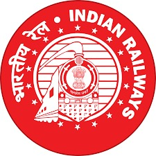

# East Coast Railway I-Card Management System



## 📌 Overview
The **East Coast Railway I-Card Management System** is a robust, full-stack solution designed to streamline the application, approval, and generation process for employee identity cards. Developed for **IT Centre/ECoR/Bhubaneswar**, the system provides a professional interface for both employees and administrators, ensuring standardized branding and enhanced security through scannable QR codes.

## 🚀 Key Features

### 👤 Employee Portal
- **Streamlined Applications**: Dedicated application flows for **Gazetted** and **Non-Gazetted** staff.
- **Comprehensive Data Entry**: Capture essential employee details, including department, designation, station, and blood group.
- **Family Management**: Support for adding multiple family members with individual identification marks and details.
- **Status Tracking**: A unified tracking interface allowing employees to check their application status in real-time using their Application Number.

### 🛡️ Admin Dashboard
- **Centralized Management**: View and filter all applications based on type (Gazetted/Non-Gazetted) and status (Pending, Approved, Rejected).
- **Application Review**: Detailed view of each application, including uploaded photos and signatures.
- **Bulk Processing**: Generate and download bulk ID card PDFs for all approved staff in a single action.
- **Secure Access**: Protected admin login with session management.

### 🪪 ID Card Generation
- **Professional Design**: Two-page ID card layout featuring official East Coast Railway branding.
- **High-Quality PDF**: Generated using `pdfkit` for crisp text and graphics.
- **Enhanced QR Codes**: Embedded QR codes containing a comprehensive JSON payload of employee details for easy digital verification.
- **Multilingual Support**: Integration of Hindi and English text for official terminology.

## 🛠️ Technology Stack

- **Frontend**: Vanilla HTML5, CSS3, JavaScript (ES6+), DataTables, FontAwesome.
- **Backend**: Node.js, Express.js.
- **Database**: MongoDB with Mongoose (stores data and Base64 encoded media for persistence).
- **Security**: Helmet, CORS, Rate-limiting, XSS protection, Mongo sanitization.
- **Utilities**: `pdfkit` (PDF generation), `qrcode` (QR implementation).

## ⚙️ Setup and Installation

### Prerequisites
- Node.js (v18 or higher)
- MongoDB (Local instance or Atlas connection string)

### Installation Steps
1. **Clone the repository**:
   ```bash
   git clone https://github.com/Sekhar03/railway-icard-system.git
   cd railway-icard-system
   ```

2. **Install dependencies**:
   ```bash
   npm install
   ```

3. **Configure Environment Variables**:
   Create a `.env` file in the root directory:
   ```env
   PORT=3000
   MONGO_URI=your_mongodb_connection_string
   ADMIN_USER=admin
   ADMIN_PASS=admin123
   ```

4. **Run the Application**:
   - For development: `npm run dev`
   - For production: `npm start`

The application will be accessible at `http://localhost:3000`.

## ☁️ Deployment

### Vercel (Recommended)
This project is configured for seamless deployment on **Vercel**:
- **Framework Preset**: Express
- **Vercel Functions**: Routes `/api/*` to the Express backend.
- **Static Assets**: Automatically served from the `/public` directory.

### GitHub Pages (Static Preview)
The `docs/` folder contains a static mirror of the frontend for preview purposes. Note that API functionality and ID card generation require the Node.js backend to be running.

## 👥 Authors
- **Developed by**: [Sekhar Parida](https://www.linkedin.com/in/sekhar-parida/)
- **Organization**: IT Centre/ECoR/Bhubaneswar

---
© 2026 East Coast Railway - IT Centre. All Rights Reserved.
